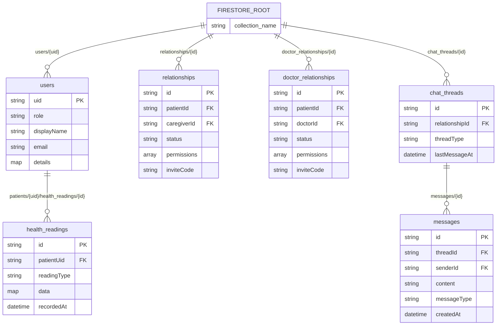
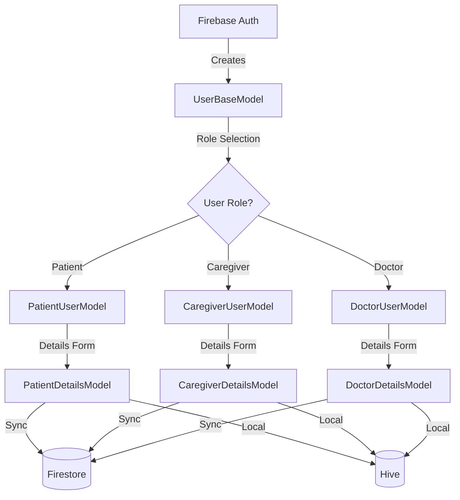
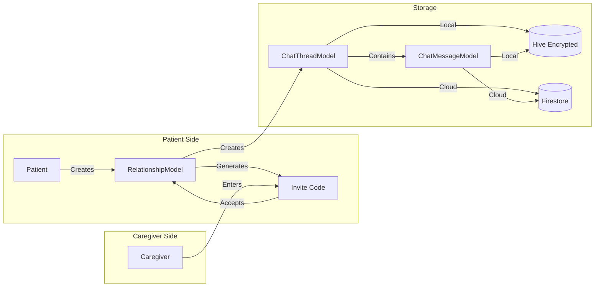
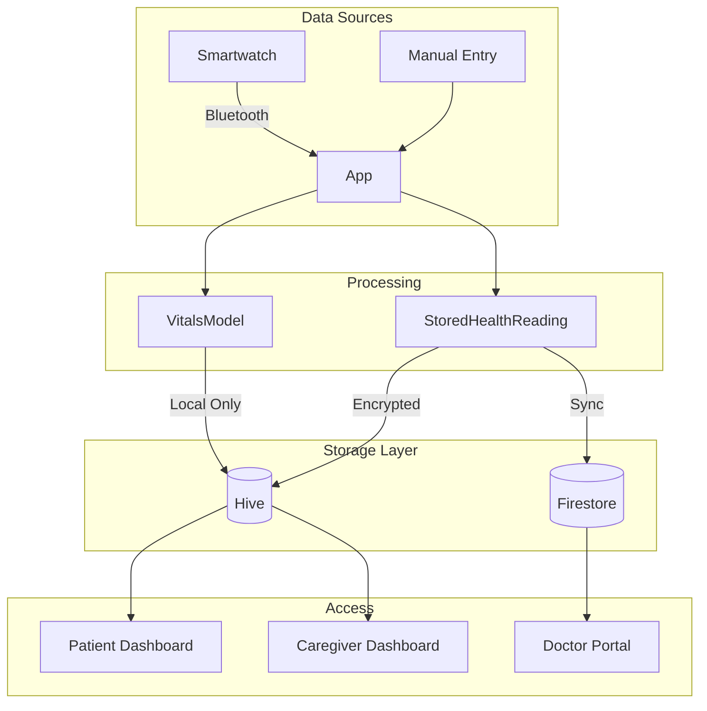
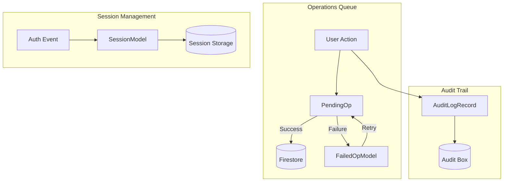

# Guardian Angel - Database Schema Diagram

## Overview

The Guardian Angel app uses a **local-first architecture** with dual storage:
- **Hive** - Local encrypted storage (primary source of truth)
- **Firebase Firestore** - Cloud sync/mirroring (non-blocking backup)

---

## Complete Entity Relationship Diagram

```mermaid
erDiagram
    %% ==================== USER & AUTHENTICATION ====================
    
    UserBaseModel {
        string uid PK "TypeId: 40"
        string email
        string fullName
        string profileImageUrl
        datetime createdAt
        datetime updatedAt
    }
    
    PatientUserModel {
        string uid PK "TypeId: 43"
        string role "patient"
        int age "min: 60"
        datetime createdAt
        datetime updatedAt
    }
    
    CaregiverUserModel {
        string uid PK "TypeId: 41"
        string role "caregiver"
        datetime createdAt
        datetime updatedAt
    }
    
    DoctorUserModel {
        string uid PK "TypeId: 51"
        string role "doctor"
        datetime createdAt
        datetime updatedAt
    }
    
    PatientDetailsModel {
        string uid PK "TypeId: 44"
        string gender
        string name
        string phoneNumber
        string address
        string medicalHistory
        bool isComplete
        datetime createdAt
        datetime updatedAt
    }
    
    CaregiverDetailsModel {
        string uid PK "TypeId: 42"
        string caregiverName
        string phoneNumber
        string emailAddress
        string relationToPatient
        string patientName
        bool isComplete
        datetime createdAt
        datetime updatedAt
    }
    
    DoctorDetailsModel {
        string uid PK "TypeId: 52"
        string fullName
        string email
        string phoneNumber
        string specialization
        string licenseNumber
        int yearsOfExperience
        string clinicOrHospitalName
        string address
        bool isVerified
        bool isComplete
        datetime createdAt
        datetime updatedAt
    }
    
    UserProfileModel {
        string id PK "TypeId: 14"
        string role
        string displayName
        string email
        string gender
        int age
        string address
        string medicalHistory
        datetime createdAt
        datetime updatedAt
    }

    %% User Relationships
    UserBaseModel ||--o| PatientUserModel : "extends"
    UserBaseModel ||--o| CaregiverUserModel : "extends"
    UserBaseModel ||--o| DoctorUserModel : "extends"
    PatientUserModel ||--o| PatientDetailsModel : "has details"
    CaregiverUserModel ||--o| CaregiverDetailsModel : "has details"
    DoctorUserModel ||--o| DoctorDetailsModel : "has details"
    UserBaseModel ||--o| UserProfileModel : "syncs to"

    %% ==================== RELATIONSHIPS ====================
    
    RelationshipModel {
        string id PK "TypeId: 45"
        string patientId FK
        string caregiverId FK
        enum status "pending|active|revoked"
        array permissions
        string inviteCode
        string createdBy
        datetime createdAt
        datetime updatedAt
    }
    
    DoctorRelationshipModel {
        string id PK "TypeId: 53"
        string patientId FK
        string doctorId FK
        enum status "pending|active|revoked"
        array permissions
        string inviteCode
        string createdBy
        datetime createdAt
        datetime updatedAt
    }

    %% Relationship Links
    PatientUserModel ||--o{ RelationshipModel : "patient in"
    CaregiverUserModel ||--o{ RelationshipModel : "caregiver in"
    PatientUserModel ||--o{ DoctorRelationshipModel : "patient in"
    DoctorUserModel ||--o{ DoctorRelationshipModel : "doctor in"

    %% ==================== CHAT SYSTEM ====================
    
    ChatThreadModel {
        string id PK "TypeId: 47"
        string relationshipId FK
        string patientId FK
        string caregiverId FK
        string doctorId FK
        enum threadType "caregiver|doctor"
        datetime createdAt
        datetime lastMessageAt
        string lastMessagePreview
        string lastMessageSenderId
        int unreadCount
        bool isArchived
        bool isMuted
    }
    
    ChatMessageModel {
        string id PK "TypeId: 48"
        string threadId FK
        string senderId FK
        string receiverId FK
        enum messageType "text|image|voice|system"
        string content
        enum localStatus "draft|pending|sent|failed"
        int retryCount
        string errorMessage
        datetime createdAt
        datetime sentAt
        datetime deliveredAt
        datetime readAt
        map metadata
        bool isDeleted
    }

    %% Chat Relationships
    RelationshipModel ||--o| ChatThreadModel : "has thread"
    DoctorRelationshipModel ||--o| ChatThreadModel : "has thread"
    ChatThreadModel ||--o{ ChatMessageModel : "contains"
    UserBaseModel ||--o{ ChatMessageModel : "sends"

    %% ==================== HEALTH DATA ====================
    
    StoredHealthReading {
        string id PK "TypeId: 55"
        string patientUid FK
        enum readingType "heartRate|bloodOxygen|sleepSession|hrvReading"
        datetime recordedAt
        datetime persistedAt
        string dataSource
        string deviceType
        string reliability
        map data
        int schemaVersion
    }
    
    VitalsModel {
        string id PK "TypeId: 13"
        string userId FK
        int heartRate
        int systolicBp
        int diastolicBp
        double temperatureC
        int oxygenPercent
        double stressIndex
        datetime recordedAt
        int schemaVersion
        datetime createdAt
        datetime updatedAt
        int modelVersion
    }

    %% Health Relationships
    PatientUserModel ||--o{ StoredHealthReading : "has readings"
    PatientUserModel ||--o{ VitalsModel : "has vitals"

    %% ==================== HOME AUTOMATION ====================
    
    RoomModelHive {
        string id PK "TypeId: 0"
        string name
        string iconId
        int color "ARGB"
        datetime createdAt
        datetime updatedAt
        int version
        string iconPath
    }
    
    DeviceModelHive {
        string id PK "TypeId: 1"
        string roomId FK
        string type
        string name
        bool isOn
        map state
        datetime lastSeen
        datetime updatedAt
        int version
    }
    
    RoomModel {
        string id PK "TypeId: 10"
        string name
        string icon
        string color
        array deviceIds
        map meta
        int schemaVersion
        datetime createdAt
        datetime updatedAt
    }
    
    DeviceModel {
        string id PK "TypeId: 12"
        string roomId FK
        string type
        string status
        map properties
        datetime createdAt
        datetime updatedAt
    }

    %% Home Automation Relationships
    RoomModelHive ||--o{ DeviceModelHive : "contains"
    RoomModel ||--o{ DeviceModel : "contains"

    %% ==================== SYSTEM TABLES ====================
    
    SessionModel {
        string id PK "TypeId: 15"
        string userId FK
        string authToken
        datetime issuedAt
        datetime expiresAt
        datetime createdAt
        datetime updatedAt
    }
    
    SettingsModel {
        bool notificationsEnabled "TypeId: 18"
        int vitalsRetentionDays
        datetime updatedAt
        bool devToolsEnabled
        string userRole
    }
    
    PendingOp {
        string id PK "TypeId: 11"
        string opType
        string idempotencyKey
        map payload
        int attempts
        string status
        string lastError
        datetime lastTriedAt
        datetime nextEligibleAt
        string entityKey
        enum priority
        enum deliveryState
    }
    
    FailedOpModel {
        string id PK "TypeId: 16"
        string sourcePendingOpId FK
        string opType
        map payload
        string errorCode
        string errorMessage
        string idempotencyKey
        int attempts
        bool archived
        datetime createdAt
        datetime updatedAt
    }
    
    AuditLogRecord {
        string type "TypeId: 17"
        string actor
        map payload
        datetime timestamp
        bool redacted
    }

    %% System Relationships
    UserBaseModel ||--o{ SessionModel : "has sessions"
    PendingOp ||--o| FailedOpModel : "may fail to"
```



---

## Firestore Collections Structure



---

## User Onboarding Flow



---

## Relationship & Chat Data Flow



---

## Health Data Architecture



---

## System Operations Flow



---

## Hive Type ID Registry

| TypeId | Model | Category | Description |
|--------|-------|----------|-------------|
| 0 | `RoomModelHive` | Home Automation | HA room |
| 1 | `DeviceModelHive` | Home Automation | HA device |
| 10 | `RoomModel` | Home Automation | Core room |
| 11 | `PendingOp` | System | Queue operation |
| 12 | `DeviceModel` | Home Automation | Core device |
| 13 | `VitalsModel` | Health | Health vitals |
| 14 | `UserProfileModel` | User | Unified profile |
| 15 | `SessionModel` | System | Auth session |
| 16 | `FailedOpModel` | System | Failed operation |
| 17 | `AuditLogRecord` | System | Audit entry |
| 18 | `SettingsModel` | System | App settings |
| 19 | `AssetsCacheEntry` | System | Cached assets |
| 24 | `SyncFailure` | System | Sync failure |
| 25 | `SyncFailureStatus` | System | Status enum |
| 26 | `SyncFailureSeverity` | System | Severity enum |
| 30 | `TransactionRecord` | System | Transaction |
| 32 | `LockRecord` | System | Lock record |
| 33 | `AuditLogEntry` | System | Extended audit |
| 34 | `AuditLogArchive` | System | Audit archive |
| 40 | `UserBaseModel` | Onboarding | Auth basics |
| 41 | `CaregiverUserModel` | Onboarding | Caregiver role |
| 42 | `CaregiverDetailsModel` | Onboarding | Caregiver details |
| 43 | `PatientUserModel` | Onboarding | Patient role |
| 44 | `PatientDetailsModel` | Onboarding | Patient details |
| 45 | `RelationshipModel` | Relationships | Patient-Caregiver |
| 46 | `RelationshipStatus` | Relationships | Status enum |
| 47 | `ChatThreadModel` | Chat | Thread |
| 48 | `ChatMessageModel` | Chat | Message |
| 49 | `ChatMessageType` | Chat | Type enum |
| 50 | `ChatMessageLocalStatus` | Chat | Status enum |
| 51 | `DoctorUserModel` | Onboarding | Doctor role |
| 52 | `DoctorDetailsModel` | Onboarding | Doctor details |
| 53 | `DoctorRelationshipModel` | Relationships | Patient-Doctor |
| 54 | `DoctorRelationshipStatus` | Relationships | Status enum |
| 55 | `StoredHealthReading` | Health | Health reading |
| 56 | `StoredHealthReadingType` | Health | Type enum |

---

## Storage Matrix

| Model | Hive Box | Firestore Path | Encrypted | Sync |
|-------|----------|----------------|-----------|------|
| `UserBaseModel` | `user_base_box` | — | ❌ | ❌ |
| `PatientUserModel` | `patient_user_box` | — | ❌ | ❌ |
| `PatientDetailsModel` | `patient_details_box` | `patient_users/{uid}` | ❌ | ✅ |
| `CaregiverUserModel` | `caregiver_user_box` | — | ❌ | ❌ |
| `CaregiverDetailsModel` | `caregiver_details_box` | `caregiver_users/{uid}` | ❌ | ✅ |
| `DoctorUserModel` | `doctor_user_box` | — | ❌ | ❌ |
| `DoctorDetailsModel` | `doctor_details_box` | `doctors/{uid}` | ❌ | ✅ |
| `UserProfileModel` | `user_profiles_box` | `users/{uid}` | ❌ | ✅ |
| `RelationshipModel` | `relationships_box` | `relationships/{id}` | ❌ | ✅ |
| `DoctorRelationshipModel` | `doctor_relationships_box` | `doctor_relationships/{id}` | ❌ | ✅ |
| `ChatThreadModel` | `chat_threads_box` | `chat_threads/{id}` | ✅ | ✅ |
| `ChatMessageModel` | `chat_messages_box` | `chat_threads/{id}/messages/{id}` | ✅ | ✅ |
| `StoredHealthReading` | `health_readings_box` | `patients/{uid}/health_readings/{id}` | ✅ | ✅ |
| `VitalsModel` | `vitals_box` | — | ❌ | ❌ |
| `SessionModel` | `sessions_box` | — | ❌ | ❌ |
| `SettingsModel` | `settings_box` | — | ❌ | ❌ |
| `PendingOp` | `pending_ops_box` | — | ❌ | ❌ |
| `FailedOpModel` | `failed_ops_box` | — | ❌ | ❌ |
| `AuditLogRecord` | `audit_logs_box` | — | ❌ | ❌ |
| `RoomModelHive` | `ha_rooms_box` | — | ❌ | ❌ |
| `DeviceModelHive` | `ha_devices_box` | — | ❌ | ❌ |

---

## Enums Reference

### RelationshipStatus
```
pending  → Invite sent, waiting for acceptance
active   → Relationship is active
revoked  → Relationship terminated
```

### ChatMessageType
```
text    → Plain text message
image   → Image attachment
voice   → Voice recording
system  → System notification
```

### ChatMessageLocalStatus
```
draft   → Saved locally, not sent
pending → Queued for sending
sent    → Successfully delivered
failed  → Send failed
```

### StoredHealthReadingType
```
heartRate    → { bpm: int, isResting: bool }
bloodOxygen  → { percentage: int }
sleepSession → { sleepStart, sleepEnd, totalMinutes, segments }
hrvReading   → { sdnnMs: double, rrIntervals: List<int>? }
```

### Relationship Permissions
```
Patient-Caregiver:        Patient-Doctor:
├── chat                  ├── chat
├── view_vitals           ├── view_records
├── sos                   ├── view_vitals
├── view_location         ├── notes
└── view_medications      ├── view_medications
                          └── emergency_access
```

---

*Generated: January 4, 2026*  
*Architecture: Local-First with Firestore Sync*
